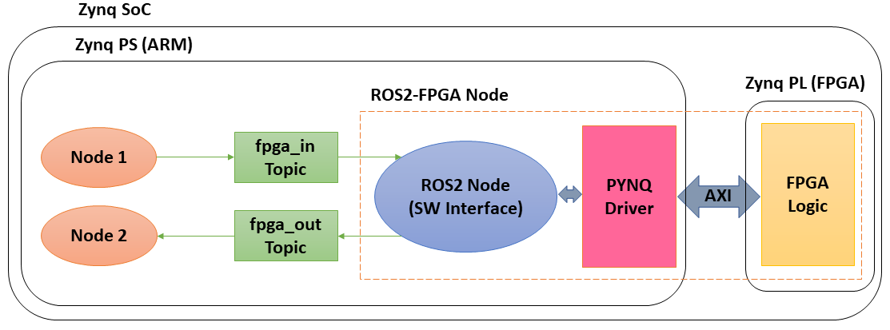

# ROS2-FOrEST-JP
ROS2-FOrESTの日本語版ドキュメントです。

# 著者
- 著者: Daniel Pinheiro Leal (University of Toronto), Midori Sugaya (Shibaura Institute of Technology), Hideharu Amano (Keio University), Takeshi Ohkawa (Tokai University)
- 連絡先: daniel.leal_at_mail.utoronto.ca and ohkawa.takeshi_at_tokai.ac.jp (Replace _at_ with @)
- 日本語ドキュメント作成: 森隼人（東海大学）

# ROS2-FOrEST
FOrEST（FPGA-Oriented Easy Synthesizer Tool）は、HLSで生成されたFPGAロジックをROS2システムに簡単かつシームレスに統合できるツールです。これを使用して、多用途で堅牢な実世界のロボットアプリケーションを高速化することが出来ます。</br>
FOrESTが生成するROS2-FPGAノードの図は以下の通りです。FOrESTは、ROS2とFPGAの間で通信するためのPYNQドライバを自動生成し、FPGAロジックをROS2パッケージに包含するために必要な全てのファイルを生成して構築します。これにより、FPGA SoCのPS部で動作する他のROS2ノード、あるいはネットワークを介してFPGA SoCのPS部と通信する分散ROS2ノードに用意にアクセスする事が出来るようになります。</br>


# 動作環境
#### PYNQ
FOrESTはPYNQ version 2.5上で動作します。
#### Python
Python 3.6での動作を確認しています。
#### 必要なPythonパッケージ
FOrESTにはjinja2のパッケージが必要です。以下のコマンドでインストールが出来ます。</br>
`pip3 install numpy jinja2`
#### ROS2
ROS2 Eloquentが必要です。[ROS2ドキュメント](https://docs.ros.org/en/eloquent/Installation/Linux-Development-Setup.html)のソースからビルドすることも出来ますが、FOrESTの著者である[大川氏のQiita記事](https://qiita.com/ohkawatks/items/e99aaaf2b4a57f840242)にてaptコマンドを使ったインストール方法が紹介されています。
#### Vivado
Vivado 2019.1とVivado HLS 2019.1で設計したFPGAロジックでの動作を確認しています。

# インストール
PYNQ2.5とROS2 Eloquentをインストールした後、Githubリポジトリのクローンを作成してFOrESTツールをインストールします。</br>
`git clone https://github.com/ros2-forest/forest.git`

# 使用方法
```
python3 forest.py [-h] [-t] [-g -i ninputs -o noutputs]

-h or --help: スクリプトの使用方法を表示します。

-t or --test: ROS2-FPGAノードと共に動作確認用のシンプルなTalkerノードとListenerノードを生成します。

-g or --genconfig: スクリプトが使用する設定ファイルのテンプレートを生成します。

-i or --ninputs: 使用する入力信号の数

-o or --noutputs: 使用する出力信号の数
```


# 出版物
FOrESTを使用または修正する場合は、このGitHubリポジトリおよび関連出版物を引用してください。
- [1] - D. Pinheiro Leal, M. Sugaya, H. Amano, T. Ohkawa "Automated Integration of High-Level Synthesis FPGA Modules with ROS2 Systems", International Conference on Field Programmable Technology (FPT), 2020.
- [2] - D. Pinheiro Leal, M. Sugaya, H. Amano, T. Ohkawa "FPGA Acceleration of ROS2-Based Reinforcement Learning Agents", CANDAR'20 - 8th International Workshop on Computer Systems and Architectures (CSA'20), 2020.
