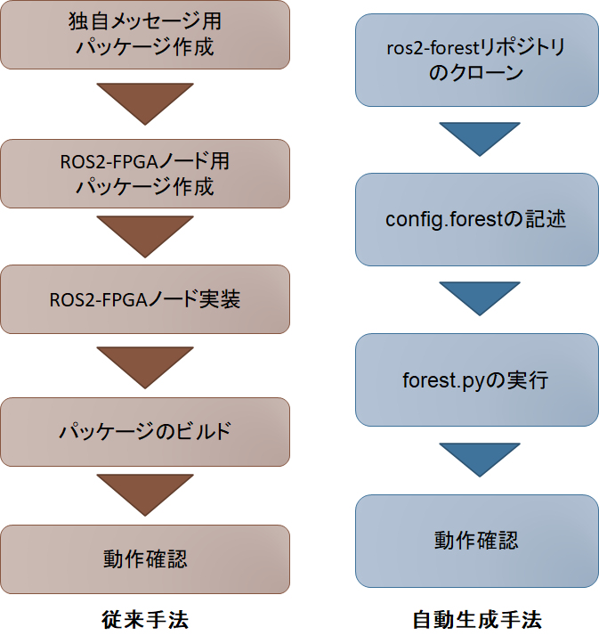
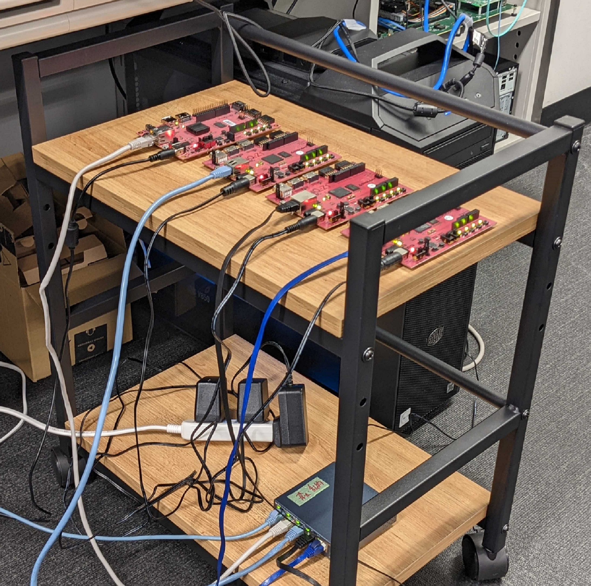

# FOrEST評価実験手順書

## 実験内容
FOrESTを用いたROS2-FPGAノード自動生成手法の評価

## 実験概要
FOrESTによるROS2-FPGAノード自動生成手法の為，被験者は以下の2つの手法でROS2-FPGAノード開発を行う．
実験には，FOrESTのサンプルプロジェクトの1つである「Forest Example Project - Convolutional Neural Network for MNIST Digit Recognition」を用いる．
1. （FOrEST有り）FOrESTを用いてROS2-FPGAノード開発
2. （FOrEST無し）手順書を見てROS2-FPGAノード開発

1，2それぞれ工程ごとに時間を計測し，開発時間と必要コード数を評価する．

1，2で取り組む順序は被験者によって入れ替える．

1，2の開発フロー比較は以下に示す（左：従来手法，右：自動生成手法）.




## 実験手順

1. 日本語版ドキュメントを用いて被験者にFOrESTの概要を説明する．
2. 加算器のサンプル（add.bit）を用いて被験者にFOrESTの実行方法を説明する．
3. 実験１：自動生成手法，従来手法のうちどちらかを行う．
4. 実験２：開発１でやらなかった方で行う．
5. 被験者はアンケートに回答する．


## 実験時間
- 実施時間：３～4時間を想定
  - 説明：1時間
  - FOrEST無し開発：1~2時間
  - FOrEST有り開発：30分
  - アンケート：30分

## アンケート
google formsを用いる（所要時間30分）

アンケートURL：https://forms.gle/JYqNWKnkGAXvUuw27

## 実験環境

- ROS2 Eloquent
- Vivado, Vivado HLSのVer2019.1
- PYNQ v2.5

### 使用ボード
PYNQ-Z1ボード3枚，PYNQ-Z2ボード1枚


- PYNQ-Z1
```
（PYNQ-Z1-A）xilinx@192.168.0.80
（PYNQ-Z1-B）xilinx@192.168.0.81
（PYNQ-Z1-C）xilinx@192.168.0.82
```

- PYNQ-Z2
```
（PYNQ-Z2）xilinx@192.168.0.83
```

### PYNQボードへの接続方法
```
ssh xilinx@192.168.0.XX
例（PYNQ-Z1-Aの場合）：ssh xilinx@192.168.0.80
```


